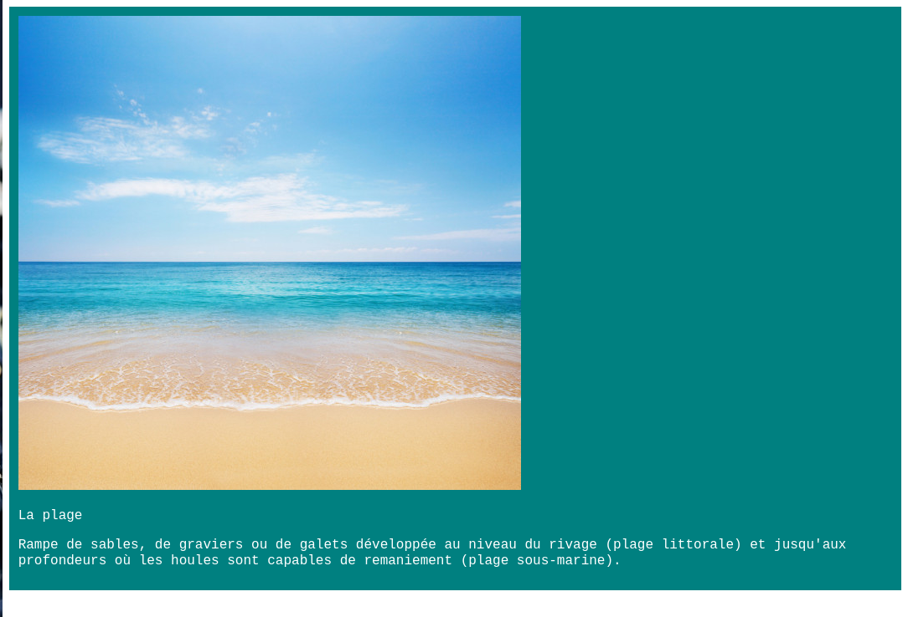

A partir de l'exemple vous aurez un résultat comme ceci : 

une image, un texte avec une police coloré 

Bon ici j'ai plusieurs fichier 
|nom            | pourquoi          |
|---------------|-------------------|
| index.html    | fichier html      |
| style.css     | fichier css       |
| img/plage.jpg | une image de plage|

note sachez que les deux fichier ont des commentaires qui explique le code

si vous ne voulez pas de commentaire il y a des version sans-commentaires 

--------
logiciel Visual studio code : [téléchargement](https://code.visualstudio.com/#alt-downloads)

n'hésitez pas à regarder la documentation mozilla sur les site web

et évitez de faire juste un copier coller, c'est pas sympa :^( 

bonne chance ! 